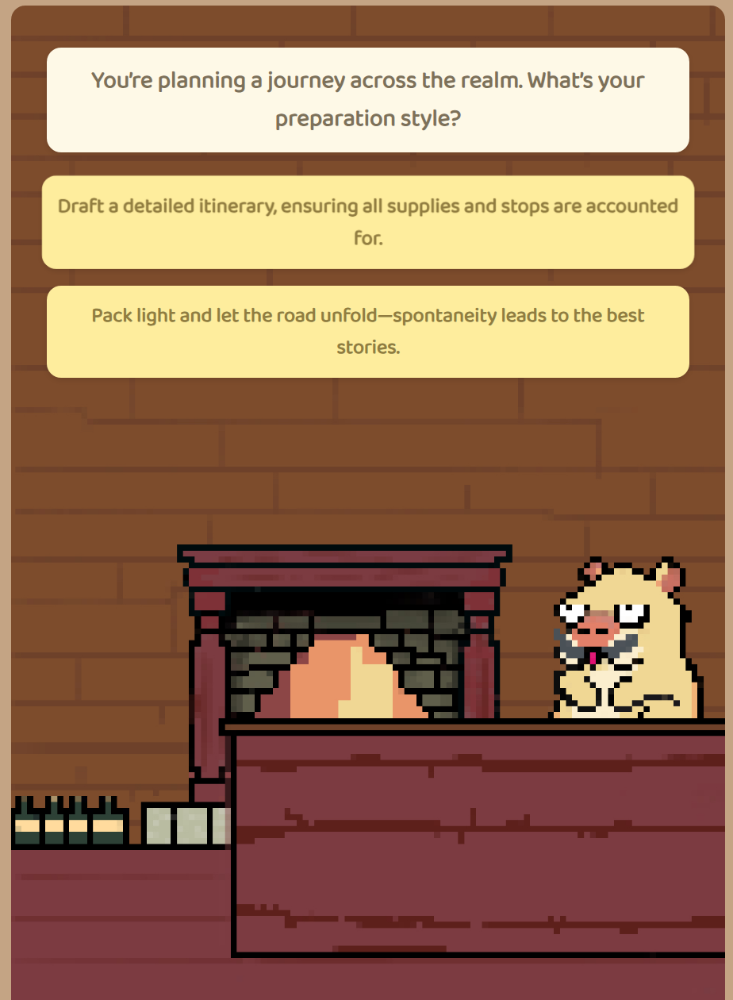
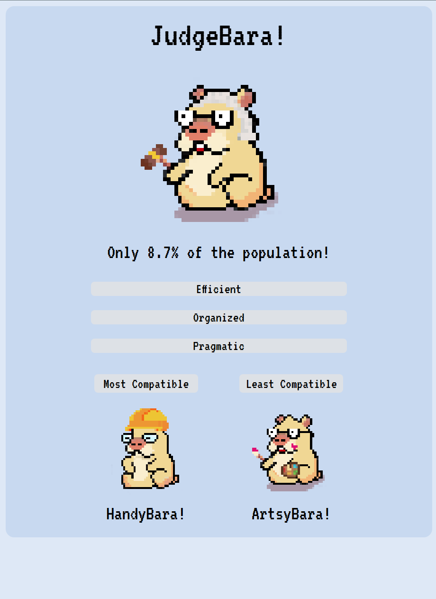

# What's My Capybara? 🦫

A fun and interactive MBTI personality test that matches you with your Capybara personality type! Find out which Capybara represents your personality and discover your most and least compatible Capybara friends.

## Features 🌟

- **Personality Assessment**: Take a quirky MBTI-based quiz with fantasy-themed questions
- **Unique Results**: Get matched with one of 16 unique Capybara personalities based on the Myers-Briggs Type Indicator
- **Compatibility Matching**: Discover which Capybara types you're most and least compatible with
- **Population Statistics**: Learn how rare your personality type is
- **Personality Traits**: View your three main personality traits

<br>


<p align="center">
  
   
</p>

## Capybara Types 🎭

- NerdyBara (INTJ)
- GamingBara (INTP)
- EmoBara (ENTJ)
- MagicalBara (ENTP)
- EnergyBara (ENFP)
- ArtsyBara (INFP)
- KnightBara (ENFJ)
- TherapyBara (INFJ)
- DetectiveBara (ISTJ)
- BakerBara (ISFJ)
- JudgeBara (ESTJ)
- RapperBara (ESFJ)
- HandyBara (ISTP)
- SingerBara (ISFP)
- JazzyBara (ESTP)
- PartyBara (ESFP)

## Technologies Used 💻

- HTML5
- CSS3
- JavaScript
- Google Fonts (Press Start 2P, VT323, Baloo 2)
- Procreate for PixelArt

## Getting Started 🚀

1. Clone the repository:
```bash
git clone [your-repository-url]
```

2. Open `index.html` in your web browser to start the quiz.

## Project Structure 📁

```
├── index.html          # Landing page with start button
├── quiz.html          # Quiz interface
├── result.html        # Results page
├── styles.css         # Main stylesheet
├── quiz.js           # Quiz logic
├── README.md         # Project documentation
└── MBTIS/            # Directory containing Capybara images
    └── *.png         # Individual Capybara personality type images
```

## How It Works 🎮

1. Start the quiz from the landing page
2. Answer 12 personality-based questions
3. Get matched with your Capybara personality type
4. View your personality traits and compatibility matches
5. Share your results with friends!
